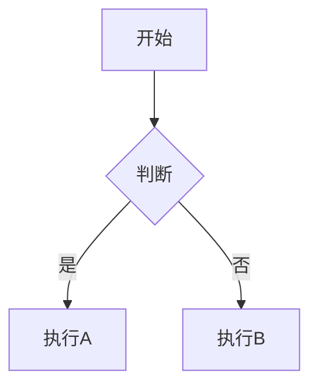

# 📝 如何写博客文章 - 完整指南

## 🎯 快速开始

### 方法一：使用命令创建（推荐）

```bash
cd pblog
hugo new content post/your-post-title.md
```

### 方法二：手动创建

1. 在 `content/post/` 目录下创建新的 `.md` 文件
2. 添加 Frontmatter（文章头部信息）
3. 使用 Markdown 语法编写内容

---

## 📋 Frontmatter 配置说明

Frontmatter 是文章顶部的配置信息，用 `---` 包围：

```yaml
---
title: '文章标题'                    # 必填：文章标题
date: 2026-04-16T10:27:03+08:00    # 必填：发布日期
lastmod: 2026-04-16T10:27:03+08:00 # 可选：最后修改日期
cover: /images/covers/cover1.jpg   # 可选：封面图片
categories: [分类1, 分类2]          # 可选：文章分类
tags: [标签1, 标签2, 标签3]        # 可选：文章标签
description: '文章摘要'            # 可选：文章描述（SEO用）
math: false                        # 可选：是否启用数学公式
mermaid: false                     # 可选：是否启用Mermaid图表
comments: true                     # 可选：是否启用评论
toc: true                          # 可选：是否显示目录
---
```

### Frontmatter 详细说明

| 字段 | 类型 | 必填 | 说明 |
|------|------|------|------|
| `title` | string | ✅ | 文章标题 |
| `date` | datetime | ✅ | 发布时间（自动生成） |
| `lastmod` | datetime | ❌ | 最后修改时间 |
| `cover` | string | ❌ | 封面图片路径 |
| `categories` | array | ❌ | 文章分类（建议1-2个） |
| `tags` | array | ❌ | 文章标签（建议3-5个） |
| `description` | string | ❌ | 文章描述，用于SEO |
| `math` | boolean | ❌ | 是否使用 KaTeX 数学公式 |
| `mermaid` | boolean | ❌ | 是否使用 Mermaid 图表 |
| `comments` | boolean | ❌ | 是否启用评论（默认true） |
| `toc` | boolean | ❌ | 是否显示目录（默认true） |

---

## ✍️ Markdown 写作技巧

### 1. 标题层级

```markdown
# 一级标题（通常不需要）
## 二级标题（章节）
### 三级标题（小节）
#### 四级标题（细节）
```

### 2. 文本样式

```markdown
**粗体文本**
*斜体文本*
***粗斜体文本***
~~删除线~~
`行内代码`
```

### 3. 列表

#### 无序列表
```markdown
- 项目一
- 项目二
  - 子项目 A
  - 子项目 B
- 项目三
```

#### 有序列表
```markdown
1. 第一步
2. 第二步
3. 第三步
```

#### 任务列表
```markdown
- [ ] 待完成任务
- [x] 已完成任务
```

### 4. 代码块

#### 普通代码块
````markdown
```python
def hello():
    print("Hello, World!")
```
````

#### 带行号和标题的代码块
````markdown
```python {linenos=true, title="hello.py"}
def hello():
    print("Hello, World!")
```
````

### 5. 链接

```markdown
[链接文本](https://example.com)
[带标题的链接](https://example.com "鼠标悬停显示")
```

### 6. 图片

```markdown


```

### 7. 引用

```markdown
> 这是一段引用文本
>
> > 这是嵌套引用
```

### 8. 表格

```markdown
| 列1 | 列2 | 列3 |
|-----|-----|-----|
| 内容1 | 内容2 | 内容3 |
| 内容4 | 内容5 | 内容6 |
```

### 9. 分隔线

```markdown
---
```

### 10. 脚注

```markdown
这是一句话[^1]

[^1]: 这是脚注内容
```

---

## 🎨 高级功能

### 数学公式（KaTeX）

设置 `math: true` 后可以使用：

```markdown
行内公式：$E = mc^2$

块级公式：
$$
\int_{a}^{b} f(x) dx = F(b) - F(a)
$$
```

### Mermaid 图表

设置 `mermaid: true` 后可以使用：

````markdown

````

### 短代码（主题提供）

#### 链接卡片
```markdown

```

#### 标签页
````markdown


内容 1


内容 2


````

---

## 📂 文件组织

### 推荐的目录结构

```
content/
├── post/                    # 所有博客文章
│   ├── tech/               # 技术类文章
│   │   ├── hugo-tutorial.md
│   │   └── python-guide.md
│   ├── life/               # 生活类文章
│   │   └── daily-note.md
│   └── _index.md           # 防止生成索引页
├── about.md                # 关于页面
└── friend.md               # 友链页面
```

### 图片资源

1. **全局图片**：放在 `static/images/` 目录
   - 引用：`/images/cover.jpg`

2. **文章专属图片**：放在与文章同目录的 `index.files/` 目录
   - 引用：`image.jpg`

---

## 🚀 发布流程

### 1. 创建文章（草稿状态）

```bash
hugo new content post/my-article.md
```

此时文章为草稿状态（`draft: true`）

### 2. 本地预览

```bash
hugo server -D
```

- `-D` 参数：显示草稿文章
- 访问：http://localhost:1313

### 3. 修改文章

使用任意文本编辑器编辑 Markdown 文件

### 4. 发布文章

将 `draft: true` 改为 `draft: false` 或直接删除这一行

### 5. 构建网站

```bash
hugo
```

生成的静态文件在 `public/` 目录

### 6. 部署

将 `public/` 目录内容部署到你的服务器或 GitHub Pages

---

## 💡 最佳实践

### 1. 文章标题

- ✅ 好标题：「如何使用Hugo搭建个人博客」
- ❌ 差标题：「第一篇文章」

### 2. 分类和标签

- **分类（Categories）**：大的分类，如「技术」、「生活」、「读书」
- **标签（Tags）**：具体关键词，如「Hugo」、「前端」、「Python」

### 3. 封面图

- 推荐尺寸：1200 x 630 px
- 格式：JPG/PNG/WebP
- 大小：建议小于 500KB

### 4. 文章结构

```
标题
├── 引言（为什么要写这篇文章）
├── 正文（核心内容）
│   ├── 小节1
│   ├── 小节2
│   └── 小节3
├── 总结
└── 参考资料/延伸阅读
```

### 5. SEO优化

```yaml
---
title: '明确的标题'                    # 包含关键词
description: '150字以内的文章描述'    # 简洁准确
tags: [关键词1, 关键词2, 关键词3]      # 3-5个相关标签
---
```

### 6. 内容建议

- 📝 定期更新（建议每周1-2篇）
- 🎨 使用图片和代码示例增强可读性
- 🔗 添加相关文章链接
- 💬 在文末引导评论

---

## 🛠️ 常用命令

```bash
# 创建新文章
hugo new content post/my-post.md

# 启动开发服务器（包含草稿）
hugo server -D

# 启动开发服务器（草稿+未来文章）
hugo server -DFE

# 构建生产版本
hugo

# 构建并最小化
hugo --minify

# 清理构建缓存
hugo --cleanDestinationDir
```

---

## 📚 参考资料

- [Hugo 官方文档](https://gohugo.io/)
- [Markdown 语法指南](https://www.markdownguide.org/)
- [reimu 主题文档](https://github.com/D-Sketon/hugo-theme-reimu)

---

**祝你写作愉快！** 🎉

如有问题，随时询问！
